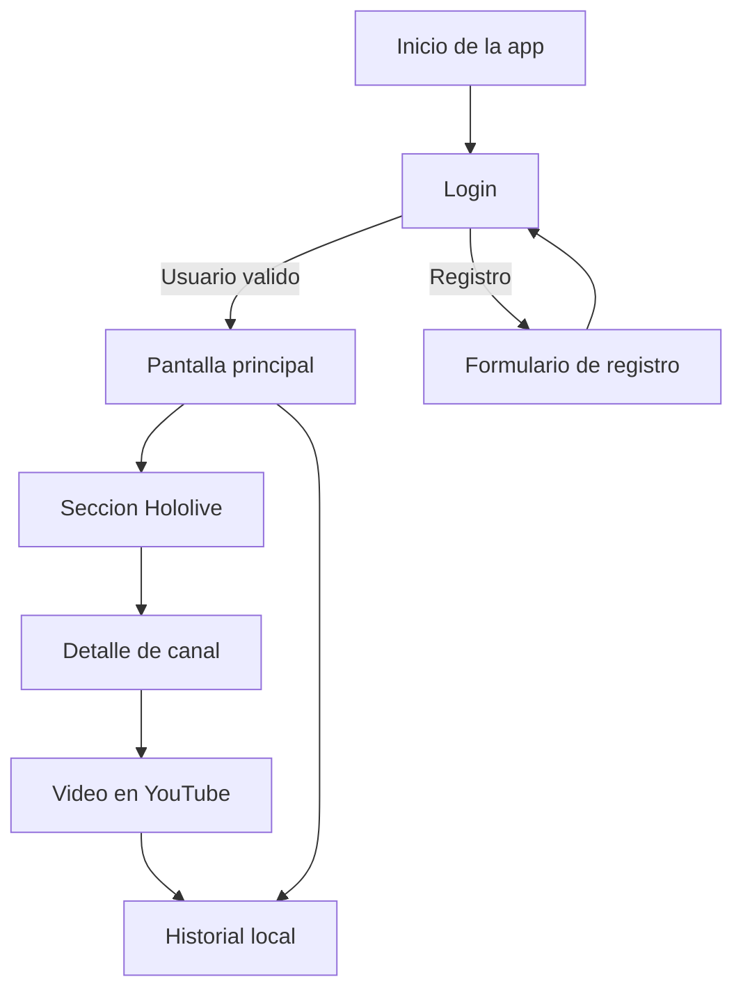
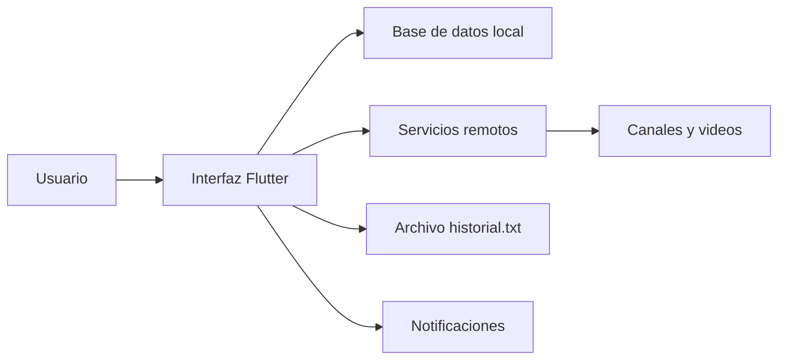
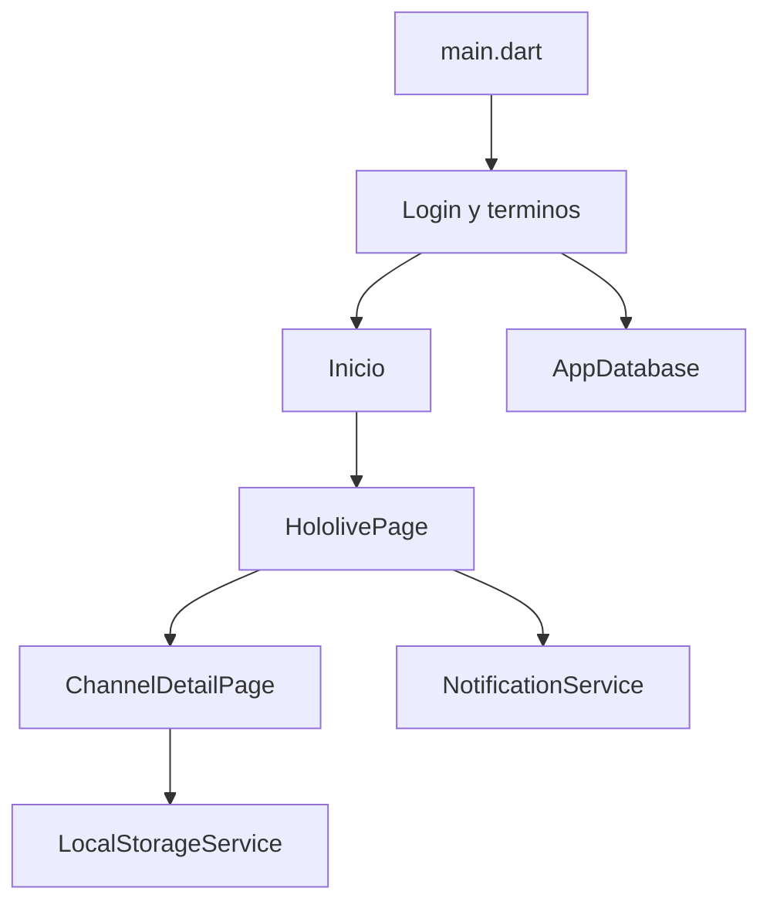

# HoloApp

## Autor

Axel Joshep Ibarra Grimaldo

## Materia

Programacion movil

## Grupo

ITI-23

## Descripcion breve

HoloApp es una aplicacion hecha con Flutter para explorar contenido de talentos de Hololive, ver transmisiones en vivo, abrir videos de YouTube y registrar el historial de reproduccion de forma local dentro del dispositivo.

## Descripcion del proyecto

El proyecto combina una pantalla de inicio de sesion, registro local de usuarios, una vista principal con widgets interactivos de Flutter y una seccion enfocada en canales, videos y transmisiones de Hololive. La app obtiene contenido remoto, permite navegar entre talentos, abre videos en YouTube y guarda automaticamente un historial local para consultar reproducciones anteriores.

Tambien incluye una base de datos local para usuarios, notificaciones para streams en vivo y una experiencia preparada para escritorio y movil.

## Caracteristicas del proyecto

- Login y registro de usuarios con almacenamiento local.
- Pantalla inicial con sliders, switch, radios, botones e imagenes para demostrar widgets de Flutter.
- Busqueda de talentos por nombre.
- Lista de canales de Hololive con detalle por canal.
- Videos recientes por canal.
- Apertura de videos en YouTube desde la app.
- Guardado de historial en `historial.txt`.
- Consulta y limpieza del historial desde la interfaz.
- Notificaciones cuando se detectan transmisiones en vivo.
- Soporte preparado para varias plataformas Flutter.

## Herramientas usadas

### Programas y entornos

- Flutter SDK.
- Dart SDK.
- Git.
- Windows 10/11 para desarrollo y compilacion local.
- Android SDK y Android Studio, en caso de ejecutar o compilar para Android.
- Navegador web para consultar documentacion y contenido remoto.

### Dependencias del proyecto

- `bcrypt` para cifrado de contraseñas.
- `flutter_svg` para soporte de SVG.
- `path` para manejo de rutas.
- `sqflite` y `sqflite_common_ffi` para la base de datos local.
- `shared_preferences` para preferencias locales.
- `http` para peticiones web.
- `url_launcher` para abrir enlaces externos.
- `flutter_local_notifications` para notificaciones.
- `path_provider` para rutas del sistema.
- `html` para procesamiento de contenido web cuando se requiere.

### Diseño e interfaz

- Flutter Material.
- Widgets nativos de Flutter para construir la interfaz.
- No se detecta en el repositorio una herramienta externa de diseño UI formal; la interfaz fue armada directamente en Flutter.

### Investigacion y documentacion

- Documentacion oficial de Flutter.
- Documentacion de Dart.
- Documentacion de Holodex y/o servicios de contenido usados por la app.
- Documentacion de `url_launcher`, `path_provider`, `sqflite` y `flutter_local_notifications`.

### IAs de apoyo

- GitHub Copilot para apoyo en redaccion, estructura y asistencia tecnica.

## Requisitos previos

Para compilarlo y correrlo en Windows se necesita tener instalado Flutter y seguir la configuracion oficial de escritorio para Windows: [Instalar Flutter en Windows](https://docs.flutter.dev/get-started/install/windows).

Tambien se recomienda revisar la configuracion de escritorio de Windows: [Configurar Flutter para Windows desktop](https://docs.flutter.dev/platform-integration/windows/setup).

Si se va a correr en Android, se necesita Android Studio o Android SDK, un emulador o un dispositivo fisico con depuracion USB.

## Donde fue probado

- Probado en Windows desktop durante el desarrollo en este workspace.
- El proyecto tambien trae configuracion para Android, iOS, Linux, macOS y Web, pero esas plataformas deben validarse por separado en tu entorno.

## Como correrlo

### En Windows desktop

```bash
flutter doctor
flutter pub get
flutter run -d windows
```

### En Android

```bash
flutter doctor
flutter pub get
flutter run -d android
```

### En Web

```bash
flutter doctor
flutter pub get
flutter run -d chrome
```

## Flujo general de uso

1. Abrir la aplicacion.
2. Iniciar sesion o registrarse.
3. Entrar a la pantalla principal.
4. Navegar a la seccion de Hololive.
5. Filtrar talentos o abrir un canal.
6. Reproducir videos desde YouTube.
7. Revisar el historial local cuando sea necesario.

## Almacenamiento local

La app guarda el historial en un archivo llamado `historial.txt` dentro del directorio de documentos de la aplicacion. Cada registro almacena:

- Fecha y hora.
- Titulo del video.
- Nombre del canal.

## Estructura general

- `lib/main.dart`: punto de entrada, login y terminos.
- `lib/registro.dart`: registro de usuarios.
- `lib/inicio.dart`: pantalla principal con widgets interactivos.
- `lib/hololive_page.dart`: listado de talentos, streams y busqueda.
- `lib/channel_detail_page.dart`: detalle de canal y videos recientes.
- `lib/historial_page.dart`: historial de reproduccion.
- `lib/services/local_storage_service.dart`: manejo del historial local.
- `lib/services/holodex_service.dart`: carga de canales y videos.
- `lib/services/notification_service.dart`: notificaciones de streams en vivo.
- `lib/database/app_database.dart`: base de datos local de usuarios.

## Diagramas

### Flujo de navegacion



### Flujo de datos



### Arquitectura general



## Valor agregado e identidad

HoloApp tiene una identidad centrada en Hololive y en la mezcla de entretenimiento con practica tecnica. No solo muestra contenido; tambien registra actividad local, notifica directos y ofrece una experiencia pensada para demostraciones de Flutter con componentes interactivos, almacenamiento y consumo de servicios externos.

## Notas finales

Si vas a cambiar el texto de grupo o agregar nuevas plataformas probadas, solo actualiza esa seccion y conserva los diagramas para mantener la identidad del proyecto.
